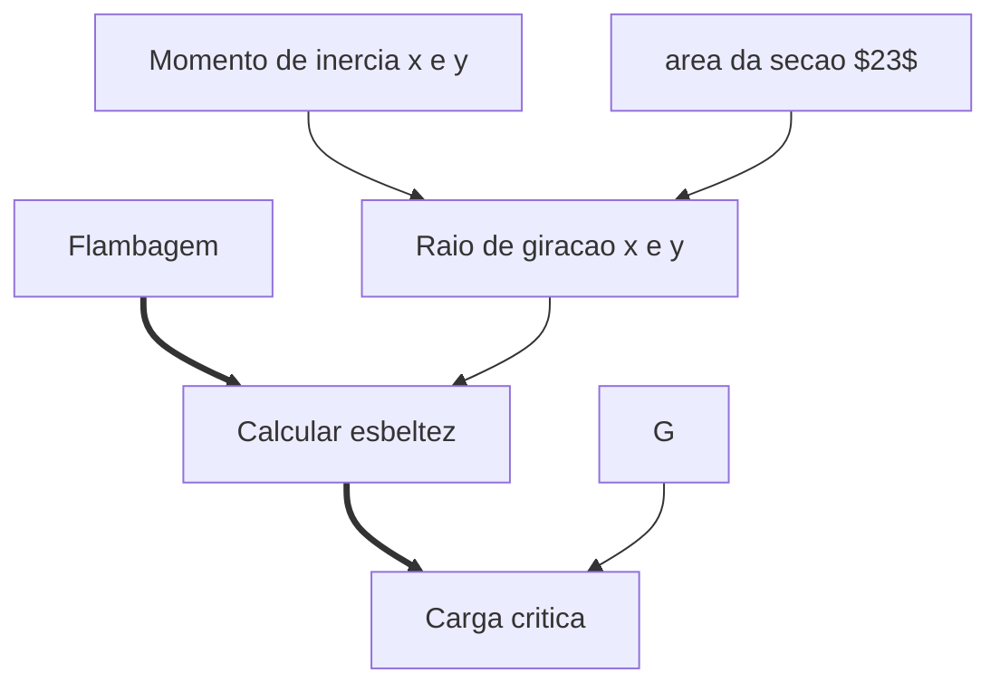
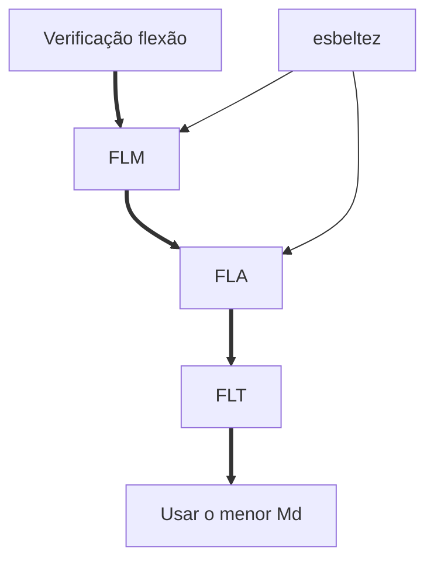

# Introdução

## Flambagem

$$P_{cr} = \frac{\pi E I}{\alpha}$$

### Flambagem Lateral com Torção

## Flexão

$$\rho = \frac{M_x}{a}$$

## Torção

$$\gamma = G \cdot \gamma$$
$$ 

Ãngulo de torção

## Tensão admissível

$$\sigma_{max} \leq \sigma = \frac{f_{yk}}{\gamma}$$

> $\sigma$ = tensão

### Momento de plastificação

$$\Zeta = b_f t_f (d - t_f) + \frac{t_w}{4} (d - 2 t_f)^2$$

