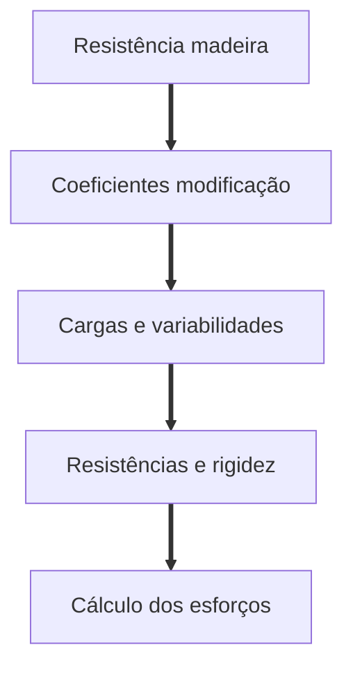

---
tags:
- madeira
- categoria
- resistencia
- flexão
- cisalhamento
- cortante
- els
- elu
---

# Flexão simples

> Uma viga de madeira dicotiledônea classe C40, cuja seção transversal mede (15x30)cm, bi – apoiada em duas paredes divisórias em alvenaria e 4,0m de vão livre sustentará uma outra parede de alvenaria em bloco cerâmico de 2,7 m de altura e 15 cm de espessura, conforme mostra a figura. Com base nestas informações, de acordo com as prescrições da NBR 7190/1997, pede-se:

> 1. Sabendo-se que trata-se de madeira recomposta de primeira categoria, que o carregamento atuante (peso da alvenaria) deve ser considerado de longa duração e
que a mesma se encontra em meio cuja umidade relativa do ar é, em média de 80%, determine a resistência de cálculo à compressão paralela às fibras (fc0,d), a resistência
de cálculo à tração paralela às fibras (ft,d), a resistência de cálculo ao cisalhamento paralelo às fibras (fv,d) e o módulo de elasticidade efetivo desta viga, a umidade de 12%.

> 2. Sabendo-se que o peso específico da alvenaria (alv) é de 13 kN/m3, e considerando o peso próprio (densidade) da viga, verifique se a viga suporta o carregamento indicado

---

## Solução

### Passo a passo

### Resistência madeira

Olhar na [tabela de madeiras](/madeiras/tabelas#classes-de-resistencias.html) sobre resistência da classe C40.

$$F_{c0,k} = 40 MPa \quad f_{v,k} = 6 MPa$$
$$E_{c0,m} = 19500 MPa \quad \rho_{ap} = 950 kgf/m3$$

### Coeficientes modificação

Olhar na [tabela de KMOD](/madeiras/tabelas#KMOD.html) sobre as modificações para:

1. Madeira recomposta com carregamento de longa duração
2. Classe de umidade 3
3. Primeira categoria

$$K_{mod1} = 0.45 \quad K_{mod2} = 0.9 \quad K_{mod3} = 1$$
$$K_{mod} = 0.405$$

### Cargas e variabilidades

Obter carga por metro:

Carga permanente = peso próprio + peso da alvenaria

$$g= (b_{alv} * h_{alv} * \rho_{alv}) * (b_{mad} * h_{mad} * \rho_{mad})$$

$$g= (0.15 * 2.7 * 13) + (0.15 * 0.3 * 9.5)$$ 

$$g = 5,265 + 0.4275 =  5.7 kN/m$$

Variabilidade:

$$\frac{g_{mad}}{g} = \frac{0.42}{5.7} = 0.075 \leq 0.75$$

Conforme [tabela variabilidade](/madeiras/tabelas.html#coeficiente-para-acao-permamente.html) a variabilidade é **grande**, portanto $\gamma_q = 1.4$

### Cálculo de resistência

Através da [tabela minoração ELU](/madeiras/tabelas.html#coeficiente-minoracao-elu.html), tem-se que $\gamma_{wc} = 1.4 \quad \gamma_{wt} = 1.8 \quad \gamma_{wv} = 1.8$

#### Compressão:

$$f_{c0,d} = K_{mod} \frac{f_{c0,k}}{\gamma_{wc}}$$
$$f_{c0,d} = 0.405 \frac{40}{1,4} = 1.16 kN /cm^2$$

#### Tração 

Obter através da [tabela de relação](/madeiras/tabelas.html#relacoes.html), coeficiente $ 0.77$:

$$f_{t,k} = \frac{f_{c0,k}}{0.77} = 5.19 kN/cm^2$$
$$f_{t,d} = k_{mod} \frac{f_{t0,k}}{\gamma_{wt}} = 0.405 \frac{5.19}{1.8} = 1.17 kN /cm^2$$

#### Cisalhamento

$$f_{v,d} = k_{mod} \frac{f_{v0,k}}{\gamma_{wv}} = 0.405 \frac{6}{1.8} = 1.35MPa = 0.135 kN /cm^2$$

$$E_{c0,ef} = k_{mod1} E_{c0,m} = 0.405 * 19500 =  7897.5 MPa$$

### Cálculo esforços

$$M_{g,d} = \gamma * \frac{q * l^2}{8} = 1.4 * \frac{5.7 * 4^2}{8} = 15.96 kNm$$

$$V_{g,d} = \gamma * \frac{q * l}{2} = 1.4 * \frac{5.7 * 4}{2} = 15.94 kN$$

#### Tensão máxima compressão

$$\rho_{cd} = \frac{M_d}{W_c}$$

$$I_x = b * h^3 / 12 = 15 * 30^3 / 12 = 33750 cm^4$$
$$W_x = I_x / (h/2) = 33750 / 15 = 2250 cm^3$$

$$\rho_{cd} = \frac{1594}{2250} = 0.71 kN / cm^2 \leq f_{c0,d} = 1.16 kN /cm^2$$

$$\rho_{cd} \leq f_{c0,d} \therefore atende$$

#### Tensão máxima cisalhamento

$$\tau_d = \frac{3 V_d}{2bh} = \frac{3 * 15.94}{2 * 15 * 30} = 0.05 kn/cm
^2$$

$$\tau_d \leq f_{v,d} = 0.135 kN /cm^2 \therefore atende$$

#### Estado limite serviço

$$U_{lim} = l/200 = 400/200 = 2cm$$
$$\delta_{max} = \frac{5qL^4}{384EI} = \frac{5 * 0.057 * 400^4}{384 * 789.75 * 33750} = 0.71 cm$$
$$\delta_{max} \leq U_{lim} = 2 cm \therefore atende$$

