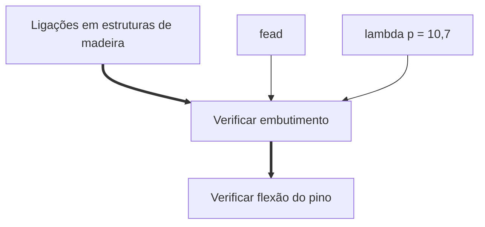

# Emendas de madeira

# Ligações de madeira

:::warning Atenção
**Ligações** são diferentes das **emendas**. Ligações são para quando a força muda de direção. 
:::

## Espaçamentos mínimos por pregos e parafusos

## Verificação para tração

