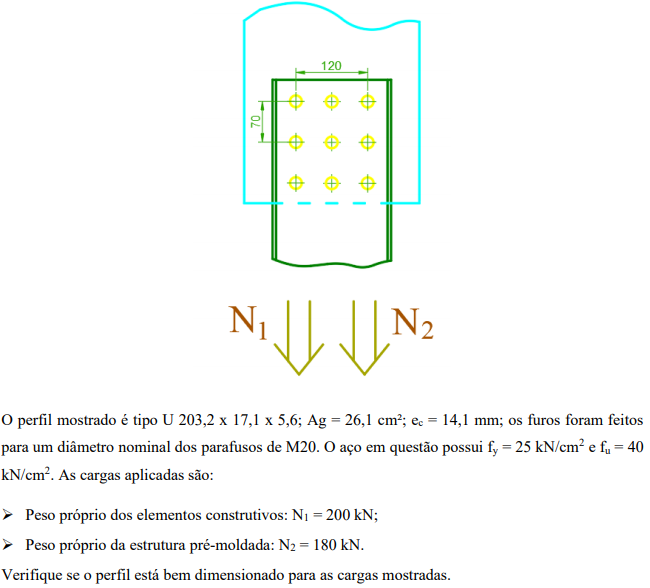

---
tags:
- tração
- metálicas
- parafusos
titulo: Resistência à tração, peça parafusada  
---

# Resistência à tração, peça parafusada

<v-chip v-for="tag in $frontmatter.tags"> {{tag}}</v-chip>

---

## Verificação para escoamento

$$N_{rd} = \frac{A_g * f_y}{\gamma_{a1}}$$

> - $N_{rd}$ = resistência 
> - $A_g$ = área bruta
> - $f_y$ = resistência escoamento
> - $\gamma_{a1}$ = coeficiente ponderação de escoamento

Obter coeficientes na [tabela da NBR 8800](/metalicas/tabelas.html#.html) obtemos que $\gamma_{a1} = 1.1$

$$N_{rd} = \frac{26.1 * 25}{1.1} = 593.18 kN$$

## Verificação para ruptura

$$N_{rd} = \frac{A_e * f_u}{\gamma_{a2}}$$

> - $N_{rd}$ = resistência 
> - $A_e$ = área efetiva
> - $f_u$ = resistência ruptura
> - $\gamma_{a2}$ = coeficiente ponderação de ruptura

Obter coeficientes na [tabela da NBR 8800](/metalicas/tabelas.html#) obtemos que $\gamma_{a2} = 1.35$

$$N_{rd} = \frac{A_e * 40}{1.35}$$

### Área efetiva (aparafusadas)

$$A_e = C_t * A_n = C_t * (A_g - \sum A_f)$$

> - $A_e$ = área efetiva
> - $C_t$ = coeficiente de redução
> - $A_n$ = área líquida
> - $A_f$ = área de cada furo

Parafuso M20 possui 20 mm de diâmetro, mas a NBR8800 considera 1.5mm de folga e 2mm para defeitos na furação, portanto $d = 20 + 3.5 = 23.5 mm$, como área da chapa $b = 5.6mm$, área reduzida pra cada furo: $A_f = d*b = 131.6 mm2$

Como a linha de ruptura é simétrica e regular com 3 furos:

$$A_n = A_g - 3 * (A_f) = 26.1 - 3 * 1.316 = 22.152 cm2$$

### Ct (perfis de seção aberta)

$$C_t = 1 - e_c / l_c$$

> - $e_c$ = excentricidade da ligação
> - $l_c$ = (length) comprimento efetivo da ligação

$l_c$ é a distância entre a primeira e última linha de furo, na direção da aplicação da força, porntanto $l_c = 70*2 = 140 cm$

$e_c = 1.41 cm$ foi dado no enunciado, considera a distância do centro de gravidade da peça e o plano de ligação

$$C_t = 1 - e_c / l_c = 1 - (1.41 / 140) = 0.989$$

--- 

Com isso conseguimos obter a área efetiva:

$$A_e = C_t * A_n = 0.989 * 22.152 = 21.908 cm2$$

E, agora a resistência de ruptura:

$$N_{rd} = \frac{21.908 * 40}{1.35} = 649 kN$$

## Combinação de cargas

$$N_{sd} = \gamma_{m1} * q_1 + \gamma_{m2} * q_2$$

> - $\gamma_y =$ coeficiente ponderção de resistência
> - $q_1 =$ carga permanente elemento construtivo
> - $q_2 =$ carga permamente pré-moldado

Obter coeficientes na [tabela da NBR 8800](/metalicas/tabelas.html#) obtemos que $\gamma_{m1} = 1.5$ e $\gamma_{m2} = 1.3$ 

$$N_{sd} = 1.5 * 200 + 1.3 * 180 = 534 kN$$

# Resposta

Como $N_{sd} < N_{rd}$ tanto no escoamento quanto ruptura, o perfil atende às solicitações