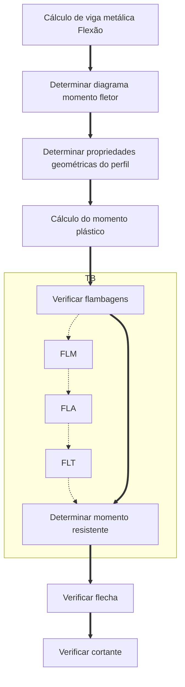
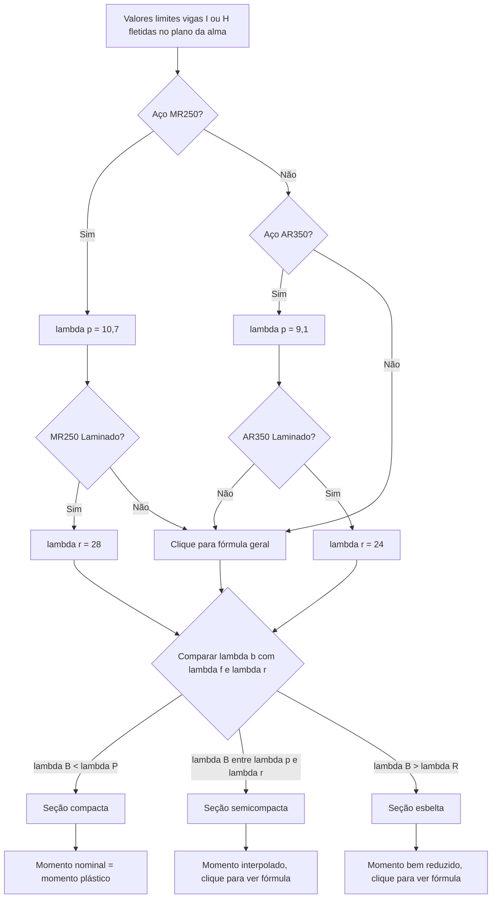

# Metálicas 

:::tip Vantagens
- Precisão milimétrica
- Garantia das dimensões e propriedades do material
- Obras mais rápidas e limpas
- Possibilita desmontagem
- Estruturas leves com grandes vãos
:::

:::danger Desvantagens
- Logística (transporte) até a obra
- Mão de obra qualificada
- Limitação do fornecimento de perfis
- Necessidade tratamento corrosão
- Necessidade tratamento contra fogo
:::

## Fluxograma flexão

## Momento plástico

## Flambagem

### FLM

Flambagem Local da Mesa

Fórmulas para cálculo generalizados.
Para aços usuais pode-se usar os valores do [fluxograma FLM](#fluxograma-flm)

:::tip
1. Determinar esbeltez da mesa
2. Comparar esbeltez com valores limites
3. Encontrar o momento resistente
:::

#### Esbeltez da mesa

$$\lambda_b = \frac{b_f}{2t_f}$$
$$\lambda_p = 0,38 \sqrt{\frac{E}{f_y}}$$
$$\lambda_f = C \sqrt{\frac{E}{0,7 {f_y}/{k_c} }}$$

>- $\lambda_b$ = esbeltez da mesa
>- $b_f$ = (beam flange?) largura da mesa
>- $t_f$ = (thickness flange?) espessura da mesa
>- $C$ =  0,83 para laminados e 0,95 para soldados

Ao comparar o $\lambda_b$ com os valores limites, categorizar a mesa como **compacta, semicompacta ou esbelta**

##### FLM compacta

Caso $\lambda_b < \lambda_p$:
$$M_n = M_{pl}$$

##### FLM semicompacta

Caso $\lambda_p < \lambda_b < \lambda_r$:
$$M_n = M_{pl}$$

##### FLM esbelta

Caso $\lambda_b > \lambda_r$:
$$M_n = M_{pl}$$

#### Fluxograma FLM

> Fonte: Tabela 6.1 PFEIL

### FLA

Flambagem Local da Alma

### FLT

Flambagem Lateral por Torção

Ocorre em vigas sem contenção lateral ou parcialmente contidas.
Verificar FLT para os trechos das vigas parcialmente contidas.
Dispensa verificação quando contidas lateralmente em todo trecho (vigas de lajes). 

## Flecha

$$flecha$$

## Cortante

$$Cortante$$