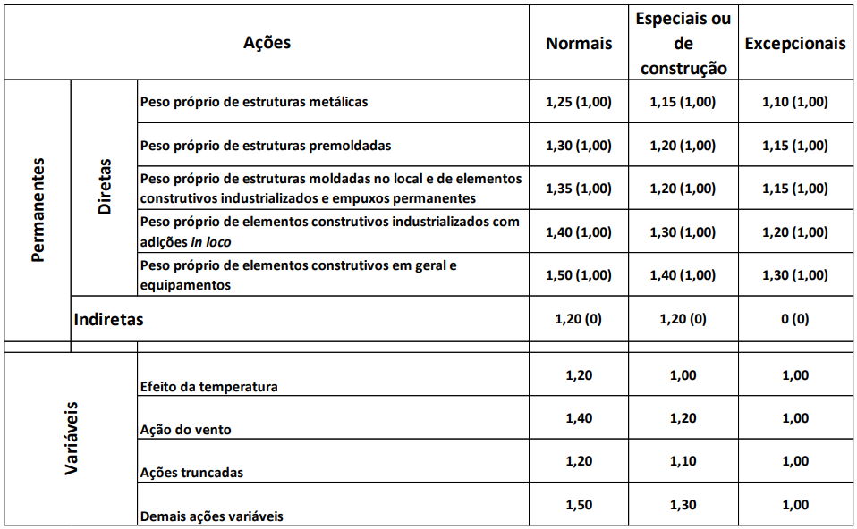

# Tabelas rápidas metálicas

## Combinação carga

<iframe src="https://docs.google.com/spreadsheets/d/e/2PACX-1vQp0qwpMtF0q_10bXdwRY6dC-ea0UQo4Pc546q8L32mfvBkuCQmJbdVBjE-aPPvffB5nNglMM0TVlgh/pubhtml?gid=831196890&amp;single=true&amp;widget=true&amp;headers=false"></iframe>

